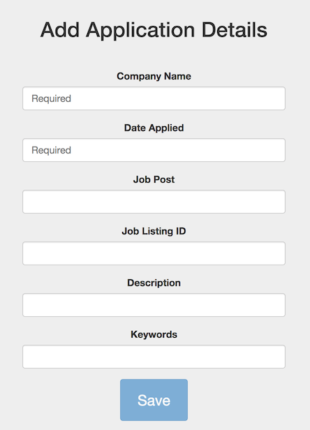
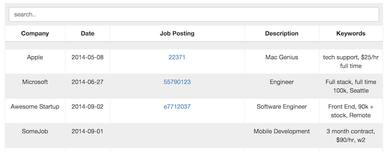

iApplied
=======

[iApplied](http://iapplied.heroku.com) is a webapp to help you keep track of jobs you've applied for!

----

Adding

Searching

Tech
-----
Using Angular and eventually full MEAN stack.

Fields
-------

The fields below are currently supported

* `Company Name` -- required
* `Date Applied` -- required
* `Link to Post` -- optional, but recomended
* `Job Listing ID` -- optional
* `Description` -- optional. Can be as long as you'd like, but ideally the job title
* `Keywords` -- optipnal, but recomended. What makes this job stick out? Enter it here for searching.

Installation
-----------
from root:

`npm install`
`bower install`

Usage
-----
`grunt serve`

Contributing
------------

See [Contributing](CONTRIBUTING.md)

Roadmap
---
(In order of priority)

* ~~NodeJS back-end~~
* Abilitiy to edit fields after submitting
* Ability to remove entries altogether.
* Import/Export data
* MongoDB for persistent data
* Google Authentication
* Reminders